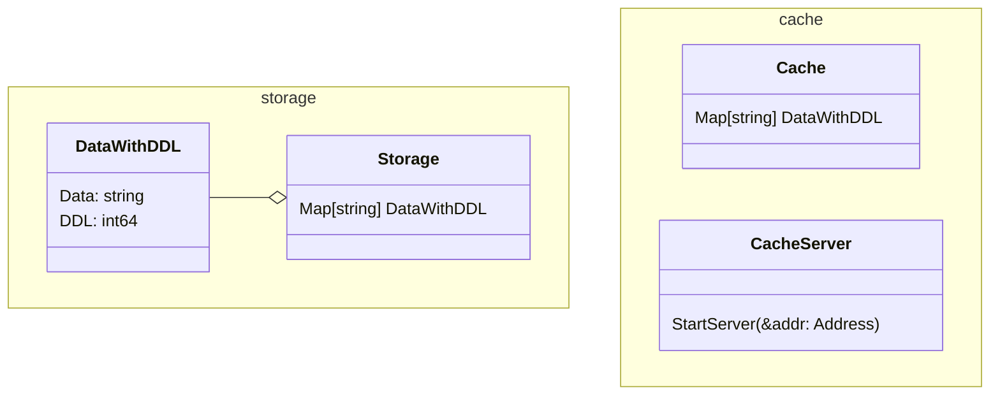

cache_node:
- 缓存数据，根据lease时间来过期数据

func outdate_data(host: string, port: string, data_name string) bool

center_node:
- 中心节点，负责修改数据，新数据到达时，等待所有lease过期，通知所有节点更新

type struct respose{
    data: string
    lease: int64
}

func request_center(host: string, port: string, data_name string) respose

<|--	Inheritance
*--	Composition
o--	Aggregation
-->	Association
--	Link (Solid)
..>	Dependency
..|>	Realization
..	Link (Dashed)

